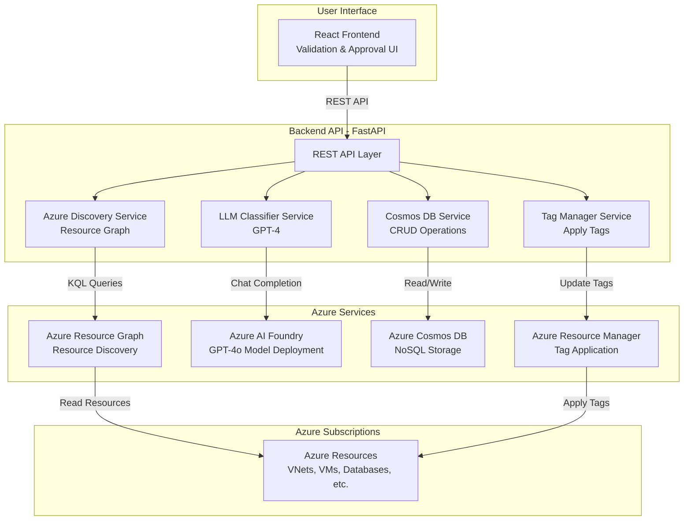
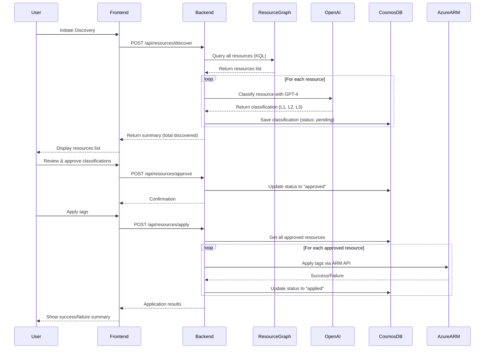

# Azure Resource Tagger

Automatically discover, classify, and tag Azure resources across all your subscriptions using LLM-powered workload categorization.

## 🎯 Overview

This application helps you organize and categorize your Azure resources by:
1. **Discovering** resources across all accessible subscriptions using Azure Resource Graph
2. **Classifying** them into a 3-level workload hierarchy using Azure OpenAI GPT-4
3. **Validating** classifications through a user-friendly frontend interface
4. **Applying** approved tags back to Azure resources

## 🏗️ Architecture

### High-Level Architecture



### Component Architecture

```
┌─────────────────────────────────────────────────────────────┐
│                    Frontend (React + TypeScript)             │
│  ┌────────────┐  ┌─────────────┐  ┌──────────────┐         │
│  │  Resource  │  │ Validation  │  │  Statistics  │         │
│  │   List     │  │     UI      │  │   Dashboard  │         │
│  └────────────┘  └─────────────┘  └──────────────┘         │
└────────────────────────┬────────────────────────────────────┘
                         │ HTTP/REST API
┌────────────────────────▼────────────────────────────────────┐
│                   Backend (FastAPI)                          │
│  ┌──────────────────────────────────────────────────────┐   │
│  │              REST API Endpoints                       │   │
│  │  /api/subscriptions | /api/resources/discover       │   │
│  │  /api/resources | /api/resources/approve            │   │
│  └──────────────────────┬───────────────────────────────┘   │
│                         │                                    │
│  ┌──────────────────┐  ┌▼──────────────┐  ┌──────────────┐ │
│  │  Azure Discovery │  │ LLM Classifier│  │  Tag Manager │ │
│  │  (Resource Graph)│  │   (GPT-4)     │  │   (ARM API)  │ │
│  └──────────────────┘  └───────────────┘  └──────────────┘ │
│                         │                                    │
│  ┌──────────────────────▼───────────────────────────────┐   │
│  │          Cosmos DB Service (Storage Layer)           │   │
│  │  - Save Classifications  - Update Status             │   │
│  │  - Get Resources        - Statistics                 │   │
│  └──────────────────────────────────────────────────────┘   │
└────────────────────────┬────────────────────────────────────┘
                         │
         ┌───────────────┼────────────────┐
         │               │                │
┌────────▼────────┐ ┌───▼──────────┐ ┌──▼────────────┐
│ Azure Resource  │ │ Azure AI     │ │  Cosmos DB    │
│     Graph       │ │   Foundry    │ │   Database    │
└─────────────────┘ └──────────────┘ └───────────────┘
                     │  GPT-4o      │
                     │  Deployment  │
                     └──────────────┘
         │
┌────────▼────────────────────────────────────────────┐
│         Azure Subscriptions & Resources             │
│  Networks | Compute | Storage | Databases | Apps   │
└─────────────────────────────────────────────────────┘
```

### Data Flow



### Authentication Flow

**All Environments (Local & Production)**:
```
Application → Service Principal (Client ID + Secret) → Azure APIs
  - Azure Resource Graph (Reader role)
  - Azure AI Foundry (AI Developer role)
  - Azure Cosmos DB (Data Contributor role)
  - Azure Resource Manager (Tag Contributor role)
```

## 📊 Classification Hierarchy

Resources are categorized into a 3-level taxonomy:

### Level 1 - Primary Category
- **Infra**: Infrastructure and foundational services
- **Data**: Data storage, processing, and analytics  
- **Apps**: Application hosting and runtime

### Level 2 - Subcategory

**Infrastructure**:
- Networking (VNets, NSGs, Load Balancers)
- Compute (VMs, VM Scale Sets, Disks)
- Storage (Storage Accounts, File Shares)
- Security (Key Vault, Firewalls)
- Management (Monitor, Policy)
- Identity (Azure AD, Managed Identities)

**Data**:
- Databases (SQL, PostgreSQL, Cosmos DB)
- Analytics (Synapse, Data Factory, Databricks)
- Messaging (Event Hub, Service Bus, Event Grid)
- Cache (Redis)
- DataLake (Data Lake Storage)

**Applications**:
- WebApps (App Service, Static Web Apps)
- Containers (AKS, Container Apps, ACR)
- Functions (Function Apps)
- APIs (API Management)
- AI_ML (Cognitive Services, Machine Learning)

### Level 3
Actual Azure service type (e.g., "Virtual Network", "AKS Cluster", "SQL Database")

### Applied Tags

```json
{
  "Workload-L1": "Apps",
  "Workload-L2": "Containers",
  "Workload-L3": "AKS Cluster"
}
```

## 🚀 Quick Start

### Prerequisites

- **Python 3.12+** - [Download](https://www.python.org/downloads/)
- **Node.js 18+** - [Download](https://nodejs.org/) (for frontend - coming soon)
- **Azure CLI** - [Install Guide](https://docs.microsoft.com/en-us/cli/azure/install-azure-cli)
- **Azure subscription** with resources to classify
- **Azure AI Foundry** hub with GPT-4o model deployment
- **Azure Cosmos DB** account (or will create during setup)
- **Azure AD Service Principal** with appropriate permissions
- **Git** - [Download](https://git-scm.com/)

### Step 1: Clone and Azure Login

```powershell
# Clone the repository
git clone https://github.com/aveekrchowdhury/azurecostmanagement.git
cd azurecostmanagement

# Login to Azure (opens browser)
az login

# Verify you're logged in and see your subscriptions
az account list --output table

# Set default subscription (optional)
az account set --subscription "your-subscription-name"
```

### Step 2: Create Service Principal

Create a Service Principal for authentication:

```powershell
# Create Service Principal
$spName = "sp-resource-tagger"
$sp = az ad sp create-for-rbac --name $spName --output json | ConvertFrom-Json

# Save these values - you'll need them for .env file
$clientId = $sp.appId
$clientSecret = $sp.password
$tenantId = $sp.tenant

Write-Host "`n=== Service Principal Created ===" -ForegroundColor Green
Write-Host "Client ID: $clientId"
Write-Host "Client Secret: $clientSecret"
Write-Host "Tenant ID: $tenantId"
Write-Host "`nSave these values securely!" -ForegroundColor Yellow
```

### Step 3: Create Azure Resources

#### Option A: Using Azure Portal

1. **Create Azure AI Foundry Hub**:
   - Navigate to [Azure Portal](https://portal.azure.com)
   - Click "+ Create a resource" → Search "Azure AI Foundry"
   - Create a new Hub resource
   - Fill in: Resource group, Name, Region
   - Create and wait for deployment

2. **Deploy GPT-4o Model**:
   - Go to your Foundry Hub → Model deployments
   - Click "+ Create deployment"
   - Select `gpt-4o` model
   - Set deployment name: `gpt-4o`
   - Configure capacity as needed
   - Get the deployment endpoint and key

3. **Create Cosmos DB Account**:
   - Click "+ Create a resource" → Search "Azure Cosmos DB"
   - Select "Azure Cosmos DB for NoSQL"
   - Fill in: Resource group, Account name, Region
   - Create and wait for deployment
   - Go to resource → Keys → Copy Primary Connection String

#### Option B: Using Azure CLI (Faster)

```powershell
# Set variables
$RESOURCE_GROUP = "rg-resource-tagger"
$LOCATION = "eastus"
$FOUNDRY_HUB_NAME = "foundry-resource-tagger"
$COSMOS_NAME = "cosmos-resource-tagger"
$DEPLOYMENT_NAME = "gpt-4o"

# Create resource group
az group create --name $RESOURCE_GROUP --location $LOCATION

# Note: Azure AI Foundry hub must be created via Portal for now
# Or use existing Foundry hub
Write-Host "Please create Azure AI Foundry hub via Portal or use existing hub" -ForegroundColor Yellow
Write-Host "Hub name: $FOUNDRY_HUB_NAME" -ForegroundColor Yellow
Write-Host "Deploy GPT-4o model with deployment name: $DEPLOYMENT_NAME" -ForegroundColor Yellow

# Get Foundry endpoint (after creating via Portal)
# Replace with your actual Foundry project endpoint
$FOUNDRY_ENDPOINT = "https://<your-foundry-project>.openai.azure.com/"
$FOUNDRY_KEY = "<your-foundry-key>"  # Get from Portal → Keys and Endpoint

# Create Cosmos DB
az cosmosdb create `
  --name $COSMOS_NAME `
  --resource-group $RESOURCE_GROUP `
  --locations regionName=$LOCATION failoverPriority=0 `
  --default-consistency-level Session

# Get Cosmos DB endpoint and key
$COSMOS_ENDPOINT = az cosmosdb show `
  --name $COSMOS_NAME `
  --resource-group $RESOURCE_GROUP `
  --query "documentEndpoint" -o tsv

$COSMOS_KEY = az cosmosdb keys list `
  --name $COSMOS_NAME `
  --resource-group $RESOURCE_GROUP `
  --type keys `
  --query "primaryMasterKey" -o tsv

# Display values (for .env file)
Write-Host "`n=== Configuration Values ===" -ForegroundColor Green
Write-Host "AZURE_OPENAI_ENDPOINT=$OPENAI_ENDPOINT"
Write-Host "AZURE_OPENAI_API_KEY=$OPENAI_KEY"
Write-Host "COSMOS_DB_ENDPOINT=$COSMOS_ENDPOINT"
Write-Host "COSMOS_DB_KEY=$COSMOS_KEY"
```

### Step 4: Assign RBAC Roles to Service Principal

Run the provided script to assign all necessary roles:

```powershell
# Save this as: scripts/assign-sp-roles.ps1
# Variables
$subscriptionId = "7c77785e-55b1-434e-914a-f520f3234923"
$resourceGroup = "rg-resource-tagger"
$cosmosAccountName = "cosmos-resource-tagger"
$foundryHubName = "foundry-resource-tagger"
$clientId = "<your-service-principal-client-id>"  # From Step 2

Write-Host "Assigning RBAC roles to Service Principal..." -ForegroundColor Green

# 1. Reader role on subscription (to discover resources)
Write-Host "Assigning Reader role..."
az role assignment create `
  --role "Reader" `
  --assignee $clientId `
  --scope "/subscriptions/$subscriptionId"

# 2. Tag Contributor role on subscription (to apply tags)
Write-Host "Assigning Tag Contributor role..."
az role assignment create `
  --role "Tag Contributor" `
  --assignee $clientId `
  --scope "/subscriptions/$subscriptionId"

# 3. Cosmos DB Data Contributor (to read/write classifications)
Write-Host "Assigning Cosmos DB Data Contributor role..."
$cosmosScope = "/subscriptions/$subscriptionId/resourceGroups/$resourceGroup/providers/Microsoft.DocumentDB/databaseAccounts/$cosmosAccountName"
az cosmosdb sql role assignment create `
  --account-name $cosmosAccountName `
  --resource-group $resourceGroup `
  --role-definition-name "Cosmos DB Built-in Data Contributor" `
  --principal-id $clientId `
  --scope "/"

# 4. AI Developer role on Foundry Hub (to use GPT-4o model)
Write-Host "Assigning AI Developer role..."
$foundryScope = "/subscriptions/$subscriptionId/resourceGroups/$resourceGroup/providers/Microsoft.MachineLearningServices/workspaces/$foundryHubName"
az role assignment create `
  --role "Azure AI Developer" `
  --assignee $clientId `
  --scope $foundryScope

Write-Host "`n✅ All roles assigned successfully!" -ForegroundColor Green
Write-Host "Service Principal now has:" -ForegroundColor Cyan
Write-Host "  - Reader (discover resources)"
Write-Host "  - Tag Contributor (apply tags)"
Write-Host "  - Cosmos DB Data Contributor (store classifications)"
Write-Host "  - Azure AI Developer (use GPT-4o)"

# Verify role assignments
Write-Host "`nVerifying role assignments..."
az role assignment list --assignee $clientId --output table
```

Run the script:

```powershell
# Make sure you're in the project directory
cd azurecostmanagement

# Create scripts directory if it doesn't exist
New-Item -ItemType Directory -Path scripts -Force

# Save the script above as scripts/assign-sp-roles.ps1
# Then run it:
.\scripts\assign-sp-roles.ps1
```

### Step 5: Configure Environment Variables

```powershell
# Copy the template
Copy-Item .env.example .env

# Edit .env file with your values
notepad .env
```

Update `.env` with the values from previous steps:

```env
# Azure Service Principal Authentication
AZURE_CLIENT_ID=<client-id-from-step-2>
AZURE_CLIENT_SECRET=<client-secret-from-step-2>
AZURE_TENANT_ID=<tenant-id-from-step-2>
AZURE_SUBSCRIPTION_ID=7c77785e-55b1-434e-914a-f520f3234923

# Azure AI Foundry
AZURE_FOUNDRY_ENDPOINT=https://<your-foundry-project>.openai.azure.com/
AZURE_FOUNDRY_API_KEY=your-foundry-key-from-portal
AZURE_FOUNDRY_DEPLOYMENT_NAME=gpt-4o
AZURE_FOUNDRY_API_VERSION=2024-05-01-preview

# Cosmos DB
COSMOS_DB_ENDPOINT=https://your-cosmos.documents.azure.com:443/
COSMOS_DB_KEY=your-key-from-portal
COSMOS_DB_DATABASE_NAME=resourcetagger
COSMOS_DB_CONTAINER_NAME=resources

# Application Settings
API_PORT=8000
FRONTEND_URL=http://localhost:3000
BACKEND_URL=http://localhost:8000
AUTH_MODE=service_principal
```

### Step 6: Backend Setup and Testing

```powershell
cd backend

# Create virtual environment
python -m venv venv

# Activate virtual environment
.\venv\Scripts\Activate.ps1

# Upgrade pip
python -m pip install --upgrade pip

# Install dependencies
pip install -r requirements.txt

# Validate configuration
python test_setup.py
```

Expected output:
```
=== Testing Configuration ===
✓ Subscription ID: 7c77785e-55b1-434e-914a-f520f3234923
✓ Tenant ID: dcdb7779-2742-4044-a9a4-7ced84b35723
✓ OpenAI Endpoint: https://...
✓ Cosmos DB Endpoint: https://...

=== Testing Azure Discovery ===
✓ Successfully connected to Azure
✓ Found 3 accessible subscriptions

=== Testing LLM Classifier ===
✓ Testing classification with sample resource...
✓ Successfully classified resource
  Level 1: Infra
  Level 2: Networking
  Level 3: Virtual Network

=== Testing Cosmos DB ===
✓ Successfully connected to Cosmos DB
✓ Statistics query successful

🎉 All tests passed! The backend is ready to use.
```

### Step 7: Run the Backend

```powershell
# Run the FastAPI server with auto-reload
python -m uvicorn app.main:app --reload
```

You should see:
```
INFO:     Uvicorn running on http://127.0.0.1:8000
INFO:     Application startup complete.
```

**Test the API**:
- Open browser: http://localhost:8000
- Swagger UI: http://localhost:8000/docs
- ReDoc: http://localhost:8000/redoc

## 📖 Usage Workflow

### Complete End-to-End Example

#### Step 1: Discover Resources

Start by discovering all resources across your subscriptions:

```powershell
# Using PowerShell with Invoke-RestMethod
$body = @{
    subscription_ids = @()  # Empty = all accessible subscriptions
    resource_groups = @()   # Optional: filter by resource groups
    resource_types = @()    # Optional: filter by resource types
    force_refresh = $false  # Set true to re-classify existing resources
} | ConvertTo-Json

Invoke-RestMethod -Uri "http://localhost:8000/api/resources/discover" `
  -Method Post `
  -Body $body `
  -ContentType "application/json"
```

**What happens**:
1. Backend queries Azure Resource Graph across all subscriptions
2. Each discovered resource is sent to GPT-4 for classification
3. Classifications are stored in Cosmos DB with status "pending"
4. You get a summary: total discovered, classified, and errors

Example response:
```json
{
  "total_discovered": 147,
  "total_classified": 145,
  "total_errors": 2,
  "message": "Discovered and classified 145 out of 147 resources"
}
```

#### Step 2: Review Classifications

Get all pending classifications to review:

```powershell
# Get all pending classifications
Invoke-RestMethod -Uri "http://localhost:8000/api/resources?status=pending&limit=100" `
  -Method Get
```

Example response:
```json
{
  "classifications": [
    {
      "id": "...",
      "resource_id": "/subscriptions/.../resourceGroups/rg-prod/providers/Microsoft.Network/virtualNetworks/vnet-prod",
      "resource_name": "vnet-prod",
      "resource_type": "Microsoft.Network/virtualNetworks",
      "level_1": "Infra",
      "level_2": "Networking",
      "level_3": "Virtual Network",
      "confidence": 0.95,
      "reasoning": "VNet is core networking infrastructure",
      "proposed_tags": {
        "Workload-L1": "Infra",
        "Workload-L2": "Networking",
        "Workload-L3": "Virtual Network"
      },
      "existing_tags": {
        "environment": "production"
      },
      "status": "pending",
      "created_at": "2026-05-22T10:30:00Z"
    }
  ],
  "total": 145
}
```

#### Step 3: Approve/Reject Classifications

Approve the classifications you agree with:

```powershell
# Approve multiple resources
$approveBody = @{
    resource_ids = @(
        "/subscriptions/.../resourceGroups/rg-prod/providers/Microsoft.Network/virtualNetworks/vnet-prod",
        "/subscriptions/.../resourceGroups/rg-prod/providers/Microsoft.Compute/virtualMachines/vm-web"
    )
    apply_immediately = $false  # Set true to apply tags right away
} | ConvertTo-Json

Invoke-RestMethod -Uri "http://localhost:8000/api/resources/approve" `
  -Method Post `
  -Body $approveBody `
  -ContentType "application/json"
```

Reject incorrect classifications:

```powershell
# Reject resources
$rejectBody = @{
    resource_ids = @(
        "/subscriptions/.../resourceGroups/rg-test/providers/Microsoft.Storage/storageAccounts/sttest123"
    )
} | ConvertTo-Json

Invoke-RestMethod -Uri "http://localhost:8000/api/resources/reject" `
  -Method Post `
  -Body $rejectBody `
  -ContentType "application/json"
```

#### Step 4: Update Classifications (Optional)

If you need to modify a classification before approval:

```powershell
$resourceId = "/subscriptions/.../resourceGroups/rg-prod/providers/Microsoft.Sql/servers/sqlserver-prod"
$subscriptionId = "7c77785e-55b1-434e-914a-f520f3234923"

$updateBody = @{
    level_1 = "Data"
    level_2 = "Databases"
    level_3 = "Azure SQL Database"
    proposed_tags = @{
        "Workload-L1" = "Data"
        "Workload-L2" = "Databases"
        "Workload-L3" = "Azure SQL Database"
        "Criticality" = "High"
    }
} | ConvertTo-Json

Invoke-RestMethod -Uri "http://localhost:8000/api/resources/$($resourceId)?subscription_id=$subscriptionId" `
  -Method Put `
  -Body $updateBody `
  -ContentType "application/json"
```

#### Step 5: Apply Tags to Azure

Once you've approved all classifications, apply the tags to your Azure resources:

```powershell
# Apply all approved tags
$result = Invoke-RestMethod -Uri "http://localhost:8000/api/resources/apply" `
  -Method Post
```

Example response:
```json
{
  "total_approved": 145,
  "successfully_applied": 143,
  "failed": 2,
  "results": [
    {
      "resource_id": "/subscriptions/.../vnet-prod",
      "success": true,
      "message": "Tags applied successfully"
    },
    {
      "resource_id": "/subscriptions/.../storage123",
      "success": false,
      "error": "Resource does not support tags"
    }
  ]
}
```

#### Step 6: View Statistics

Check the overall progress and distribution:

```powershell
# Get statistics
Invoke-RestMethod -Uri "http://localhost:8000/api/statistics" -Method Get
```

Example response:
```json
{
  "total": 147,
  "pending": 0,
  "approved": 143,
  "rejected": 2,
  "applied": 143,
  "failed": 2,
  "by_workload": {
    "Infra": 89,
    "Data": 31,
    "Apps": 27
  }
}
```

### Using curl (Alternative)

```bash
# Discover resources
curl -X POST http://localhost:8000/api/resources/discover \
  -H "Content-Type: application/json" \
  -d '{}'

# Get pending resources
curl "http://localhost:8000/api/resources?status=pending"

# Approve resources
curl -X POST http://localhost:8000/api/resources/approve \
  -H "Content-Type: application/json" \
  -d '{"resource_ids": ["..."], "apply_immediately": false}'

# Apply tags
curl -X POST http://localhost:8000/api/resources/apply

# Get statistics
curl http://localhost:8000/api/statistics
```

## 🔧 Configuration

### Environment Variables

```env
# Azure Configuration
AZURE_SUBSCRIPTION_ID=your-subscription-id
AZURE_TENANT_ID=your-tenant-id

# Azure OpenAI
AZURE_OPENAI_ENDPOINT=https://your-openai.openai.azure.com/
AZURE_OPENAI_API_KEY=your-api-key
AZURE_OPENAI_DEPLOYMENT_NAME=gpt-4

# Cosmos DB
COSMOS_DB_ENDPOINT=https://your-cosmos.documents.azure.com:443/
COSMOS_DB_KEY=your-cosmos-key
COSMOS_DB_DATABASE_NAME=resourcetagger
COSMOS_DB_CONTAINER_NAME=resources

# Application
API_PORT=8000
FRONTEND_URL=http://localhost:3000
AUTH_MODE=local  # or managed_identity for production
```

## 🏢 Production Deployment

### Deployment Architecture

```
Production Environment:
┌──────────────────────────────────────────────────────────┐
│ Azure Container Apps (Backend)                           │
│ - Python FastAPI                                         │
│ - System-assigned Managed Identity                       │
│ - Auto-scaling (0-10 instances)                         │
│ - HTTPS with custom domain                              │
└──────────────────────────────────────────────────────────┘
                         │
                         ▼
┌──────────────────────────────────────────────────────────┐
│ Azure Static Web Apps (Frontend)                        │
│ - React SPA                                              │
│ - CDN-backed                                             │
│ - Custom domain with SSL                                │
└──────────────────────────────────────────────────────────┘
                         │
         ┌───────────────┼───────────────┐
         ▼               ▼               ▼
┌────────────┐  ┌─────────────┐  ┌──────────────┐
│ Azure      │  │ Azure       │  │ Cosmos DB    │
│ OpenAI     │  │ Resource    │  │ NoSQL        │
│ (GPT-4)    │  │ Graph       │  │              │
└────────────┘  └─────────────┘  └──────────────┘
```

### Prerequisites for Deployment

- Azure subscription with appropriate permissions
- Azure CLI installed and logged in
- Azure Developer CLI (azd) installed
- Docker installed (for Container Apps)
- Node.js 18+ (for frontend build)

### Option 1: Deploy with Azure Developer CLI (Recommended)

Azure Developer CLI (`azd`) provides the fastest deployment path:

#### Step 1: Install azd

```powershell
# Install azd using PowerShell
winget install microsoft.azd
```

Or download from: https://aka.ms/install-azd

#### Step 2: Initialize azd

```powershell
# Navigate to project root
cd azurecostmanagement

# Initialize azd (if not already done)
azd init

# When prompted:
# - Environment name: "production" or "dev"
# - Select subscription
# - Select region (e.g., eastus)
```

#### Step 3: Configure environment

```powershell
# Set environment variables for azd
azd env set AZURE_OPENAI_DEPLOYMENT_NAME gpt-4
azd env set COSMOS_DB_DATABASE_NAME resourcetagger
azd env set COSMOS_DB_CONTAINER_NAME resources
```

#### Step 4: Deploy

```powershell
# Provision infrastructure and deploy application
azd up

# This will:
# 1. Create resource group
# 2. Provision Cosmos DB
# 3. Provision Azure OpenAI (if not exists)
# 4. Create Container Registry
# 5. Build and push backend Docker image
# 6. Create Container App with Managed Identity
# 7. Assign RBAC roles
# 8. Deploy Static Web App (frontend)
# 9. Configure CORS and networking
```

Expected output:
```
Provisioning Azure resources (azd provision)
  Provisioned resourceGroup (1m 2s)
  Provisioned cosmosDbAccount (4m 30s)
  Provisioned containerRegistry (2m 15s)
  Provisioned containerApp (3m 45s)
  Provisioned staticWebApp (1m 20s)

Deploying services (azd deploy)
  Building backend Docker image
  Pushing to Container Registry
  Deploying to Container Apps
  Building frontend
  Deploying to Static Web Apps

SUCCESS: Your application is deployed!
- Backend URL: https://app-resource-tagger.proudcoast-abc123.eastus.azurecontainerapps.io
- Frontend URL: https://wonderful-wave-abc123.azurestaticapps.net
```

#### Step 5: Assign Permissions

After deployment, assign required roles to the Managed Identity:

```powershell
# Get the managed identity principal ID
$principalId = azd env get-values | Select-String "AZURE_CONTAINER_APP_PRINCIPAL_ID" | ForEach-Object { $_.ToString().Split('=')[1].Trim('"') }

# Get subscription ID
$subscriptionId = azd env get-values | Select-String "AZURE_SUBSCRIPTION_ID" | ForEach-Object { $_.ToString().Split('=')[1].Trim('"') }

# Assign Reader role
az role assignment create `
  --role "Reader" `
  --assignee $principalId `
  --scope "/subscriptions/$subscriptionId"

# Assign Tag Contributor role
az role assignment create `
  --role "Tag Contributor" `
  --assignee $principalId `
  --scope "/subscriptions/$subscriptionId"
```

### Option 2: Manual Deployment

If you prefer step-by-step control:

#### Step 1: Create Azure Resources

```powershell
# Variables
$RESOURCE_GROUP = "rg-resource-tagger-prod"
$LOCATION = "eastus"
$CONTAINER_REGISTRY = "acrresourcetagger"
$CONTAINER_APP_ENV = "env-resource-tagger"
$CONTAINER_APP = "app-resource-tagger"
$COSMOS_DB = "cosmos-resource-tagger-prod"
$OPENAI = "openai-resource-tagger-prod"
$STATIC_WEB_APP = "swa-resource-tagger"

# Create resource group
az group create --name $RESOURCE_GROUP --location $LOCATION

# Create Container Registry
az acr create `
  --resource-group $RESOURCE_GROUP `
  --name $CONTAINER_REGISTRY `
  --sku Basic `
  --admin-enabled true

# Create Cosmos DB
az cosmosdb create `
  --name $COSMOS_DB `
  --resource-group $RESOURCE_GROUP `
  --locations regionName=$LOCATION `
  --default-consistency-level Session

# Create Azure OpenAI
az cognitiveservices account create `
  --name $OPENAI `
  --resource-group $RESOURCE_GROUP `
  --kind OpenAI `
  --sku S0 `
  --location $LOCATION

# Deploy GPT-4
az cognitiveservices account deployment create `
  --name $OPENAI `
  --resource-group $RESOURCE_GROUP `
  --deployment-name gpt-4 `
  --model-name gpt-4 `
  --model-version "0613" `
  --model-format OpenAI `
  --sku-capacity 10 `
  --sku-name "Standard"
```

#### Step 2: Build and Push Backend Docker Image

```powershell
# Login to Container Registry
az acr login --name $CONTAINER_REGISTRY

# Build and push Docker image
cd backend
az acr build `
  --registry $CONTAINER_REGISTRY `
  --image resource-tagger-backend:latest `
  --file Dockerfile .
```

#### Step 3: Create Container App Environment

```powershell
az containerapp env create `
  --name $CONTAINER_APP_ENV `
  --resource-group $RESOURCE_GROUP `
  --location $LOCATION
```

#### Step 4: Deploy Container App

```powershell
# Get connection strings
$cosmosEndpoint = az cosmosdb show --name $COSMOS_DB --resource-group $RESOURCE_GROUP --query documentEndpoint -o tsv
$cosmosKey = az cosmosdb keys list --name $COSMOS_DB --resource-group $RESOURCE_GROUP --query primaryMasterKey -o tsv
$openaiEndpoint = az cognitiveservices account show --name $OPENAI --resource-group $RESOURCE_GROUP --query properties.endpoint -o tsv
$openaiKey = az cognitiveservices account keys list --name $OPENAI --resource-group $RESOURCE_GROUP --query key1 -o tsv
$acrServer = az acr show --name $CONTAINER_REGISTRY --query loginServer -o tsv

# Deploy Container App
az containerapp create `
  --name $CONTAINER_APP `
  --resource-group $RESOURCE_GROUP `
  --environment $CONTAINER_APP_ENV `
  --image "$acrServer/resource-tagger-backend:latest" `
  --target-port 8000 `
  --ingress external `
  --registry-server $acrServer `
  --registry-identity system `
  --system-assigned `
  --min-replicas 0 `
  --max-replicas 10 `
  --env-vars `
    "COSMOS_DB_ENDPOINT=$cosmosEndpoint" `
    "COSMOS_DB_KEY=$cosmosKey" `
    "AZURE_OPENAI_ENDPOINT=$openaiEndpoint" `
    "AZURE_OPENAI_API_KEY=$openaiKey" `
    "AZURE_OPENAI_DEPLOYMENT_NAME=gpt-4" `
    "AUTH_MODE=managed_identity"
```

#### Step 5: Deploy Frontend to Static Web Apps

```powershell
# Create Static Web App
az staticwebapp create `
  --name $STATIC_WEB_APP `
  --resource-group $RESOURCE_GROUP `
  --location $LOCATION

# Deploy (requires GitHub repo linked)
# Or use SWA CLI:
cd ../frontend
npm run build
npx @azure/static-web-apps-cli deploy `
  --app-location "./dist" `
  --resource-group $RESOURCE_GROUP `
  --app-name $STATIC_WEB_APP
```

### Post-Deployment Configuration

#### 1. Configure CORS

```powershell
# Get Static Web App URL
$frontendUrl = az staticwebapp show `
  --name $STATIC_WEB_APP `
  --resource-group $RESOURCE_GROUP `
  --query "defaultHostname" -o tsv

# Update Container App with CORS
az containerapp update `
  --name $CONTAINER_APP `
  --resource-group $RESOURCE_GROUP `
  --set-env-vars "FRONTEND_URL=https://$frontendUrl"
```

#### 2. Assign RBAC Roles

```powershell
# Get managed identity
$principalId = az containerapp show `
  --name $CONTAINER_APP `
  --resource-group $RESOURCE_GROUP `
  --query "identity.principalId" -o tsv

# Assign Reader + Tag Contributor on all subscriptions you want to manage
$subscriptions = az account list --query "[].id" -o tsv

foreach ($subId in $subscriptions) {
    az role assignment create --role "Reader" --assignee $principalId --scope "/subscriptions/$subId"
    az role assignment create --role "Tag Contributor" --assignee $principalId --scope "/subscriptions/$subId"
}
```

#### 3. Configure Custom Domain (Optional)

```powershell
# For Static Web App
az staticwebapp hostname set `
  --name $STATIC_WEB_APP `
  --resource-group $RESOURCE_GROUP `
  --hostname "app.yourdomain.com"

# For Container App
az containerapp hostname add `
  --name $CONTAINER_APP `
  --resource-group $RESOURCE_GROUP `
  --hostname "api.yourdomain.com"
```

### Monitoring and Logs

```powershell
# View Container App logs
az containerapp logs show `
  --name $CONTAINER_APP `
  --resource-group $RESOURCE_GROUP `
  --follow

# View metrics
az monitor metrics list `
  --resource "/subscriptions/$subscriptionId/resourceGroups/$RESOURCE_GROUP/providers/Microsoft.App/containerApps/$CONTAINER_APP" `
  --metric Requests

# Enable Application Insights
$aiKey = az monitor app-insights component create `
  --app app-insights-resource-tagger `
  --location $LOCATION `
  --resource-group $RESOURCE_GROUP `
  --query "instrumentationKey" -o tsv

az containerapp update `
  --name $CONTAINER_APP `
  --resource-group $RESOURCE_GROUP `
  --set-env-vars "APPLICATIONINSIGHTS_CONNECTION_STRING=$aiKey"
```

### Scaling and Performance

```powershell
# Configure autoscaling rules
az containerapp update `
  --name $CONTAINER_APP `
  --resource-group $RESOURCE_GROUP `
  --min-replicas 1 `
  --max-replicas 20 `
  --scale-rule-name http-rule `
  --scale-rule-type http `
  --scale-rule-http-concurrency 50
```

### Cost Optimization

- **Container Apps**: Use scale-to-zero (min-replicas 0) for dev/test
- **Cosmos DB**: Use autoscale RUs (400-4000) instead of provisioned
- **Azure OpenAI**: Monitor TPM usage, use GPT-3.5 for non-critical classifications
- **Static Web Apps**: Free tier sufficient for most use cases

### Deployment Updates

```powershell
# Redeploy backend
cd backend
az acr build --registry $CONTAINER_REGISTRY --image resource-tagger-backend:latest .
az containerapp update `
  --name $CONTAINER_APP `
  --resource-group $RESOURCE_GROUP `
  --image "$acrServer/resource-tagger-backend:latest"

# Redeploy frontend
cd ../frontend
npm run build
npx @azure/static-web-apps-cli deploy --app-location "./dist"
```

### Backup and Disaster Recovery

```powershell
# Enable Cosmos DB continuous backup
az cosmosdb update `
  --name $COSMOS_DB `
  --resource-group $RESOURCE_GROUP `
  --backup-policy-type Continuous

# Enable geo-redundancy
az cosmosdb update `
  --name $COSMOS_DB `
  --resource-group $RESOURCE_GROUP `
  --locations regionName=eastus failoverPriority=0 `
  --locations regionName=westus failoverPriority=1
```

## 📁 Project Structure

```
azurecostmanagement/
├── .azure/
│   └── deployment-plan.md       # Detailed architecture docs
├── backend/
│   ├── app/
│   │   ├── __init__.py
│   │   ├── main.py              # FastAPI application
│   │   ├── config.py            # Configuration
│   │   ├── models.py            # Data models
│   │   └── services/
│   │       ├── azure_discovery.py   # Resource Graph
│   │       ├── llm_classifier.py    # OpenAI classification
│   │       ├── cosmos_db.py         # Cosmos DB ops
│   │       └── tag_manager.py       # Tag application
│   ├── requirements.txt
│   ├── test_setup.py            # Validation script
│   └── README.md
├── frontend/                    # React app (TBD)
├── .env.example
├── .env
├── .gitignore
└── README.md
```

## 🧪 Testing

### Test Backend Setup

```powershell
cd backend
python test_setup.py
```

This validates:
- ✅ Configuration loaded correctly
- ✅ Azure CLI authentication working
- ✅ Subscription access
- ✅ Azure OpenAI connection
- ✅ Cosmos DB connection

### Manual API Testing

```powershell
# Health check
curl http://localhost:8000/

# Get subscriptions
curl http://localhost:8000/api/subscriptions

# Discover resources
curl -X POST http://localhost:8000/api/resources/discover \
  -H "Content-Type: application/json" \
  -d "{}"
```

## 🔐 Security & Permissions

### Required Azure Permissions

The application needs the following permissions to function:

| Permission | Scope | Purpose |
|------------|-------|---------|
| **Reader** | Subscription(s) | Discover and read resource metadata |
| **Tag Contributor** | Subscription(s) | Apply/modify tags on resources |
| **Azure AI Developer** | Azure AI Foundry Hub | Use GPT-4o model for classification |
| **Cosmos DB Data Contributor** | Cosmos DB | Read/write classification data |

### Setting Up Permissions

#### Using Service Principal (Recommended)

The application uses Service Principal authentication for all environments.

**Quick Setup Script**:

Create and run `scripts/setup-service-principal.ps1`:

```powershell
# scripts/setup-service-principal.ps1
param(
    [Parameter(Mandatory=$true)]
    [string]$SubscriptionId,
    
    [Parameter(Mandatory=$true)]
    [string]$ResourceGroup,
    
    [Parameter(Mandatory=$true)]
    [string]$CosmosAccountName,
    
    [Parameter(Mandatory=$true)]
    [string]$FoundryHubName,
    
    [Parameter(Mandatory=$false)]
    [string]$ServicePrincipalName = "sp-resource-tagger"
)

Write-Host "Setting up Service Principal for Resource Tagger..." -ForegroundColor Green

# 1. Create Service Principal
Write-Host "`n1. Creating Service Principal: $ServicePrincipalName" -ForegroundColor Cyan
$sp = az ad sp create-for-rbac --name $ServicePrincipalName --output json | ConvertFrom-Json

$clientId = $sp.appId
$clientSecret = $sp.password
$tenantId = $sp.tenant

Write-Host "✓ Service Principal Created" -ForegroundColor Green
Write-Host "  Client ID: $clientId"
Write-Host "  Tenant ID: $tenantId"
Write-Host "  Client Secret: $clientSecret" -ForegroundColor Yellow

# 2. Assign Reader role on subscription
Write-Host "`n2. Assigning Reader role on subscription..." -ForegroundColor Cyan
az role assignment create `
  --role "Reader" `
  --assignee $clientId `
  --scope "/subscriptions/$SubscriptionId" `
  --output none
Write-Host "✓ Reader role assigned" -ForegroundColor Green

# 3. Assign Tag Contributor role on subscription
Write-Host "`n3. Assigning Tag Contributor role on subscription..." -ForegroundColor Cyan
az role assignment create `
  --role "Tag Contributor" `
  --assignee $clientId `
  --scope "/subscriptions/$SubscriptionId" `
  --output none
Write-Host "✓ Tag Contributor role assigned" -ForegroundColor Green

# 4. Get Service Principal Object ID for Cosmos DB
$spObjectId = az ad sp show --id $clientId --query id -o tsv

# 5. Assign Cosmos DB Data Contributor role
Write-Host "`n4. Assigning Cosmos DB Data Contributor role..." -ForegroundColor Cyan
az cosmosdb sql role assignment create `
  --account-name $CosmosAccountName `
  --resource-group $ResourceGroup `
  --role-definition-name "Cosmos DB Built-in Data Contributor" `
  --principal-id $spObjectId `
  --scope "/" `
  --output none
Write-Host "✓ Cosmos DB Data Contributor role assigned" -ForegroundColor Green

# 6. Assign Azure AI Developer role on Foundry Hub
Write-Host "`n5. Assigning Azure AI Developer role on Foundry Hub..." -ForegroundColor Cyan
$foundryScope = "/subscriptions/$SubscriptionId/resourceGroups/$ResourceGroup/providers/Microsoft.MachineLearningServices/workspaces/$FoundryHubName"
az role assignment create `
  --role "Azure AI Developer" `
  --assignee $clientId `
  --scope $foundryScope `
  --output none
Write-Host "✓ Azure AI Developer role assigned" -ForegroundColor Green

# 7. Display summary
Write-Host "`n" -NoNewline
Write-Host "=" * 80 -ForegroundColor Green
Write-Host "Service Principal Setup Complete!" -ForegroundColor Green
Write-Host "=" * 80 -ForegroundColor Green
Write-Host ""
Write-Host "Add these to your .env file:" -ForegroundColor Cyan
Write-Host ""
Write-Host "AZURE_CLIENT_ID=$clientId"
Write-Host "AZURE_CLIENT_SECRET=$clientSecret" -ForegroundColor Red
Write-Host "AZURE_TENANT_ID=$tenantId"
Write-Host "AZURE_SUBSCRIPTION_ID=$SubscriptionId"
Write-Host ""
Write-Host "⚠️  Save the Client Secret securely - it won't be shown again!" -ForegroundColor Yellow
Write-Host ""

# 8. Verify roles
Write-Host "Verifying role assignments..." -ForegroundColor Cyan
az role assignment list --assignee $clientId --output table

Write-Host "`n✅ Setup complete! The Service Principal is ready to use." -ForegroundColor Green
```

**Run the setup script**:

```powershell
.\scripts\setup-service-principal.ps1 `
  -SubscriptionId "7c77785e-55b1-434e-914a-f520f3234923" `
  -ResourceGroup "rg-resource-tagger" `
  -CosmosAccountName "cosmos-resource-tagger" `
  -FoundryHubName "foundry-resource-tagger"
```

#### For Multiple Subscriptions

If you need to manage resources across multiple subscriptions:

```powershell
# scripts/assign-roles-multiple-subscriptions.ps1
param(
    [Parameter(Mandatory=$true)]
    [string]$ClientId,
    
    [Parameter(Mandatory=$false)]
    [string[]]$SubscriptionIds = @()  # Empty = all accessible subscriptions
)

# Get all subscriptions if not specified
if ($SubscriptionIds.Count -eq 0) {
    Write-Host "Getting all accessible subscriptions..." -ForegroundColor Cyan
    $SubscriptionIds = az account list --query "[].id" -o tsv
    Write-Host "Found $($SubscriptionIds.Count) subscriptions" -ForegroundColor Green
}

# Assign roles to each subscription
foreach ($subId in $SubscriptionIds) {
    Write-Host "`nProcessing subscription: $subId" -ForegroundColor Cyan
    
    # Reader role
    Write-Host "  Assigning Reader role..."
    az role assignment create `
      --role "Reader" `
      --assignee $ClientId `
      --scope "/subscriptions/$subId" `
      --output none
    
    # Tag Contributor role
    Write-Host "  Assigning Tag Contributor role..."
    az role assignment create `
      --role "Tag Contributor" `
      --assignee $ClientId `
      --scope "/subscriptions/$subId" `
      --output none
    
    Write-Host "  ✓ Roles assigned for subscription: $subId" -ForegroundColor Green
}

Write-Host "`n✅ All subscriptions configured!" -ForegroundColor Green
```

**Run the script**:

```powershell
# For all accessible subscriptions
.\scripts\assign-roles-multiple-subscriptions.ps1 -ClientId "<your-client-id>"

# Or for specific subscriptions
.\scripts\assign-roles-multiple-subscriptions.ps1 `
  -ClientId "<your-client-id>" `
  -SubscriptionIds @("sub-id-1", "sub-id-2", "sub-id-3")
```

### Authentication Methods

#### Service Principal (All Environments)

Uses **Service Principal with Client Secret**:

```
Application Flow:
1. Load credentials from environment variables
   - AZURE_CLIENT_ID
   - AZURE_CLIENT_SECRET
   - AZURE_TENANT_ID
2. Authenticate with Azure AD
3. Get access token
4. Use token for all Azure API calls
```

**Benefits**:
- Consistent across dev and prod
- Fine-grained RBAC control
- Easy to rotate credentials
- Supports automation
- No interactive login required

**Security**:
- Store secrets in Azure Key Vault (production)
- Use .env file (local development)
- Never commit secrets to source control
- Rotate secrets regularly (90 days)
- Use separate service principals per environment

### Security Best Practices

1. **Never commit secrets**:
   - `.env` is in `.gitignore`
   - Use Azure Key Vault for production secrets
   - Use Managed Identity in production

2. **Least Privilege**:
   - Use Reader + Tag Contributor (not Contributor)
   - Scope to specific subscriptions
   - Avoid using Owner role

3. **Audit Access**:
   ```powershell
   # Review who can modify tags
   az role assignment list --role "Tag Contributor" --output table
   
   # Check Cosmos DB access
   az cosmosdb sql role assignment list `
     --account-name $cosmosAccountName `
     --resource-group $resourceGroup
   ```

4. **Monitor Usage**:
   - Enable Azure Monitor for Container Apps
   - Log all tag modifications
   - Set up alerts for failed operations

### Troubleshooting Permissions

**"Forbidden" or "Authorization failed"**:
```powershell
# Verify your permissions
az role assignment list --assignee $userObjectId --output table

# Check specific subscription access
az account show --subscription $subscriptionId
```

**"Resource not found"**:
```powershell
# Verify resource exists and you can see it
az resource show --ids $resourceId
```

**"Cannot apply tags"**:
- Some resource types don't support tags (e.g., Microsoft.Network/privateEndpoints)
- Check Tag Contributor role is assigned
- Verify no Azure Policy blocking tags

## 🐛 Troubleshooting

### Azure Authentication Issues

**Problem**: `az login` fails with MSAL cache error
```
AttributeError: Can't get attribute 'NormalizedResponse' on <module 'msal.throttled_http_client'>
```

**Solution**: Delete corrupted MSAL cache
```powershell
Remove-Item -Path "$env:USERPROFILE\.azure\msal_http_cache.bin" -Force
az login
```

**Problem**: "No subscriptions found"

**Solution**: Check subscription access
```powershell
# List all subscriptions
az account list --output table

# Set default subscription
az account set --subscription "subscription-name"

# Verify current subscription
az account show
```

### Azure Resource Discovery Issues

**Problem**: "No resources found"

**Diagnosis**:
```powershell
# Test Resource Graph query directly
az graph query -q "Resources | take 10"
```

**Solutions**:
1. Verify Reader permissions: `az role assignment list --assignee <your-id> --output table`
2. Check subscription is accessible: `az account show`
3. Try querying specific subscription in request body
4. Verify resources exist in the subscription

**Problem**: Discovery is slow or times out

**Solutions**:
1. Filter by specific resource groups or types
2. Process subscriptions one at a time
3. Increase request timeout in `azure_discovery.py`
4. Use pagination with smaller page sizes

### Azure OpenAI Issues

**Problem**: "Azure AI Foundry error" or 401 Unauthorized

**Diagnosis**:
```powershell
# Test Foundry connection
$endpoint = "https://<your-foundry-project>.openai.azure.com/"
$key = "your-foundry-key"

curl "$endpoint/openai/deployments?api-version=2024-05-01-preview" `
  -H "api-key: $key"
```

**Solutions**:
1. Verify Foundry endpoint URL (must end with `/`)
2. Check API key is correct (regenerate if needed)
3. Verify deployment name is `gpt-5.4-mini`
4. Check Service Principal has "Azure AI Developer" role on Foundry Hub
5. Ensure GPT-4o model is deployed and not paused
6. Verify Service Principal credentials in .env are correct

**Problem**: Classification is incorrect or low confidence

**Solutions**:
1. Review `CLASSIFICATION_PROMPT` in `llm_classifier.py`
2. Add more examples for specific resource types
3. Increase temperature for more creative classifications (current: 0.3)
4. GPT-4o provides best results (already configured)
5. Provide more context in resource properties
6. Review Foundry model deployment settings

### Cosmos DB Issues

**Problem**: "Cosmos DB connection failed"

**Diagnosis**:
```powershell
# Test Cosmos connection
$endpoint = "https://your-cosmos.documents.azure.com:443/"
$key = "your-key"

curl "$endpoint/dbs" `
  -H "x-ms-version: 2018-12-31" `
  -H "x-ms-date: $(Get-Date -Format 'r')" `
  -H "authorization: type=master&ver=1.0&sig=..."  # Complex auth
```

**Solutions**:
1. Verify endpoint URL (must include `:443/`)
2. Check key is correct (use primary key)
3. Verify Cosmos DB account exists
4. Database/container auto-create if they don't exist
5. Check firewall settings (allow Azure services or your IP)

**Problem**: "Request rate is large" (429 errors)

**Solutions**:
1. Increase Cosmos DB throughput (RUs)
2. Implement retry logic with exponential backoff (already in code)
3. Use bulk operations for batch inserts
4. Consider using autoscale RUs
5. Check if query is efficient (add indexes)

### Tag Application Issues

**Problem**: "Failed to apply tags"

**Common Causes**:
1. **Resource doesn't support tags**: Some types like private endpoints don't support tags
   ```powershell
   # Check if resource type supports tags
   az provider show --namespace Microsoft.Network --query "resourceTypes[?resourceType=='privateEndpoints'].capabilities"
   ```

2. **Insufficient permissions**: Need Tag Contributor role
   ```powershell
   # Verify Tag Contributor role
   az role assignment list --role "Tag Contributor" --assignee <your-id>
   ```

3. **Resource is locked**: Remove lock before applying tags
   ```powershell
   # List locks
   az lock list --resource-group <rg-name>
   
   # Delete lock
   az lock delete --name <lock-name> --resource-group <rg-name>
   ```

4. **Azure Policy blocking**: Policy may prevent tag modifications
   ```powershell
   # List applicable policies
   az policy assignment list --scope /subscriptions/<subscription-id>
   ```

5. **Resource doesn't exist**: May have been deleted
   ```powershell
   # Verify resource exists
   az resource show --ids <resource-id>
   ```

### Python/Backend Issues

**Problem**: Import errors or missing modules

**Solution**:
```powershell
# Ensure virtual environment is activated
.\venv\Scripts\Activate.ps1

# Reinstall dependencies
pip install --upgrade pip
pip install -r requirements.txt --force-reinstall
```

**Problem**: Port 8000 already in use

**Solution**:
```powershell
# Find and kill process using port 8000
$port = 8000
$process = Get-NetTCPConnection -LocalPort $port -ErrorAction SilentlyContinue
if ($process) {
    Stop-Process -Id $process.OwningProcess -Force
}

# Or use different port
python -m uvicorn app.main:app --reload --port 8001
```

**Problem**: Configuration not loading

**Solution**:
```powershell
# Verify .env file exists and has correct values
Get-Content .env

# Test configuration loading
python -c "from app.config import settings; print(settings.model_dump())"
```

### Performance Issues

**Problem**: Slow classification

**Solutions**:
1. Use parallel processing for large batches
2. Implement caching for common resource types
3. Use GPT-3.5 Turbo for faster (but less accurate) results
4. Batch multiple resources in single OpenAI call
5. Increase OpenAI quota/TPM

**Problem**: High Cosmos DB costs

**Solutions**:
1. Use autoscale RUs instead of provisioned
2. Reduce container throughput after bulk operations
3. Implement TTL for old classifications
4. Use bulk operations for writes
5. Add indexes only on queried properties

### Common Error Messages

| Error | Cause | Solution |
|-------|-------|----------|
| `KeyError: 'AZURE_OPENAI_ENDPOINT'` | Missing .env variable | Add to .env file |
| `azure.core.exceptions.ClientAuthenticationError` | Invalid credentials | Run `az login` or check API keys |
| `CosmosResourceNotFoundError` | Database doesn't exist | Will auto-create on first run |
| `429 Too Many Requests` | Rate limit exceeded | Implement backoff, increase quota |
| `ResourceNotFound` | Resource ID invalid | Verify resource exists in Azure |
| `AuthorizationFailed` | Missing permissions | Assign Reader + Tag Contributor roles |

### Debug Mode

Enable detailed logging for troubleshooting:

```python
# Add to backend/app/main.py
import logging
logging.basicConfig(level=logging.DEBUG)
```

Or set environment variable:
```powershell
$env:LOG_LEVEL = "DEBUG"
python -m uvicorn app.main:app --reload
```

### Getting Help

1. Check [backend/README.md](backend/README.md) for detailed service documentation
2. Review [.azure/deployment-plan.md](.azure/deployment-plan.md) for architecture details
3. Enable debug logging and check uvicorn output
4. Test individual services with `backend/test_setup.py`
5. Check Azure Portal for resource health and metrics
6. Review Activity Log in Azure Portal for RBAC issues

## 📝 API Documentation

Once the backend is running, visit:
- **Swagger UI**: http://localhost:8000/docs
- **ReDoc**: http://localhost:8000/redoc

## 🤝 Contributing

We welcome contributions! Here's how to get involved:

### Reporting Issues

Found a bug or have a feature request?

1. Check [existing issues](https://github.com/aveekrchowdhury/azurecostmanagement/issues)
2. Create a new issue with:
   - Clear description
   - Steps to reproduce (for bugs)
   - Expected vs actual behavior
   - Environment details (Python version, OS, etc.)

### Contributing Code

1. **Fork the repository**
   ```powershell
   # Fork on GitHub, then clone your fork
   git clone https://github.com/YOUR-USERNAME/azurecostmanagement.git
   cd azurecostmanagement
   ```

2. **Create a feature branch**
   ```powershell
   git checkout -b feature/your-feature-name
   ```

3. **Make your changes**
   - Follow existing code style
   - Add tests for new functionality
   - Update documentation
   - Run tests: `python backend/test_setup.py`

4. **Commit with clear messages**
   ```powershell
   git add .
   git commit -m "feat: Add support for custom classification rules"
   ```

5. **Push and create Pull Request**
   ```powershell
   git push origin feature/your-feature-name
   ```

   Then open a Pull Request on GitHub with:
   - Description of changes
   - Why the change is needed
   - Testing performed
   - Screenshots (if UI changes)

### Development Guidelines

**Code Style**:
- Python: Follow PEP 8 (use `black` formatter)
- TypeScript: Follow Airbnb style guide
- Use type hints in Python
- Add docstrings for public functions

**Testing**:
- Add unit tests for new services
- Add integration tests for API endpoints
- Ensure `test_setup.py` passes
- Test with real Azure resources in dev subscription

**Documentation**:
- Update README.md if adding features
- Update backend/README.md for service changes
- Add inline comments for complex logic
- Update .azure/deployment-plan.md for architecture changes

### Areas to Contribute

**High Priority**:
- [ ] Frontend implementation (React + TypeScript)
- [ ] Bulk operations optimization
- [ ] Custom classification rules engine
- [ ] Export classifications to CSV/Excel
- [ ] Azure Policy integration
- [ ] Multi-tenant support

**Medium Priority**:
- [ ] Classification confidence tuning
- [ ] Resource type-specific prompts
- [ ] Tag conflict resolution
- [ ] Audit trail / change history
- [ ] Scheduled re-classification
- [ ] Email notifications

**Documentation**:
- [ ] Video tutorials
- [ ] Architecture diagrams (detailed)
- [ ] API usage examples
- [ ] Deployment best practices
- [ ] Troubleshooting guide expansion

**Testing**:
- [ ] Unit test coverage > 80%
- [ ] Integration tests
- [ ] Load testing
- [ ] Security testing

### Code Review Process

1. Automated checks must pass:
   - Linting (flake8, eslint)
   - Tests (pytest, jest)
   - Type checking (mypy, tsc)

2. Manual review by maintainer:
   - Code quality
   - Architecture alignment
   - Security considerations
   - Performance impact

3. Approval and merge:
   - Squash and merge for feature branches
   - Semantic versioning for releases

## 📚 Additional Resources

### Documentation

- **Backend Details**: [backend/README.md](backend/README.md)
- **Architecture**: [.azure/deployment-plan.md](.azure/deployment-plan.md)
- **API Reference**: http://localhost:8000/docs (when running)

### Azure Documentation

- [Azure Resource Graph](https://learn.microsoft.com/azure/governance/resource-graph/)
- [Azure OpenAI Service](https://learn.microsoft.com/azure/cognitive-services/openai/)
- [Azure Cosmos DB](https://learn.microsoft.com/azure/cosmos-db/)
- [Azure Container Apps](https://learn.microsoft.com/azure/container-apps/)
- [Azure Resource Manager Tags](https://learn.microsoft.com/azure/azure-resource-manager/management/tag-resources)

### Related Projects

- [Azure Resource Graph Explorer](https://portal.azure.com/#blade/HubsExtension/ArgQueryBlade)
- [Azure Tag Governance](https://learn.microsoft.com/azure/governance/policy/samples/built-in-policies#tags)
- [Azure Cost Management](https://learn.microsoft.com/azure/cost-management-billing/)

### Community

- **Issues**: [GitHub Issues](https://github.com/aveekrchowdhury/azurecostmanagement/issues)
- **Discussions**: [GitHub Discussions](https://github.com/aveekrchowdhury/azurecostmanagement/discussions)
- **Pull Requests**: [GitHub PRs](https://github.com/aveekrchowdhury/azurecostmanagement/pulls)

## 📊 Classification System Details

### How Classification Works

The system uses GPT-4 to intelligently classify Azure resources based on:

1. **Resource Type**: e.g., `Microsoft.Network/virtualNetworks`
2. **Resource Name**: e.g., `vnet-prod-eastus`
3. **Resource Properties**: Size, SKU, configuration
4. **Existing Tags**: Previous categorization
5. **Location & Resource Group**: Naming patterns

### Classification Prompt

The LLM receives a detailed prompt with:
- Complete taxonomy (3 levels)
- Examples for each category
- Resource metadata
- Instructions for confidence scoring

Example prompt snippet:
```
You are an Azure resource classification expert. Classify this resource:

Type: Microsoft.Compute/virtualMachines
Name: vm-web-prod-001
Properties: {size: "Standard_D4s_v3", os: "Linux"}

Classification Hierarchy:
Level 1: Infra, Data, or Apps
Level 2: (subcategory based on L1)
Level 3: (specific service)

Return JSON:
{
  "level_1": "Apps",
  "level_2": "WebApps",
  "level_3": "Virtual Machine",
  "confidence": 0.85,
  "reasoning": "VM hosting web application..."
}
```

### Confidence Scores

- **0.9-1.0**: High confidence, clear resource type mapping
- **0.7-0.9**: Medium confidence, typical resource
- **0.5-0.7**: Low confidence, ambiguous or complex resource
- **< 0.5**: Very low confidence, requires human review

### Taxonomy Extension

To add new categories, edit `backend/app/services/llm_classifier.py`:

```python
CLASSIFICATION_PROMPT = """
...
Level 2 - Apps subcategories:
- WebApps: Web applications, frontend, APIs
- Containers: Docker, Kubernetes, container instances
- Functions: Serverless functions, event-driven
- APIs: API Management, API gateways
- AI_ML: AI/ML services, cognitive services
- IoT: IoT services (NEW CATEGORY)  # Add here
...
"""
```

And update enums in `backend/app/models.py`:

```python
class WorkloadLevel2Apps(str, Enum):
    WebApps = "WebApps"
    Containers = "Containers"
    Functions = "Functions"
    APIs = "APIs"
    AI_ML = "AI_ML"
    IoT = "IoT"  # Add here
```

### Tag Format

Generated tags follow this format:

```python
{
    "Workload-L1": "Infra",      # Primary category
    "Workload-L2": "Networking",  # Subcategory
    "Workload-L3": "Virtual Network"  # Specific service
}
```

These tags enable:
- Cost analysis by workload type
- Resource organization
- Automated governance
- Reporting and visualization

### Example Classifications

| Resource Type | Name | L1 | L2 | L3 |
|---------------|------|----|----|-----|
| Microsoft.Network/virtualNetworks | vnet-prod | Infra | Networking | Virtual Network |
| Microsoft.Compute/virtualMachines | vm-web-01 | Apps | WebApps | Virtual Machine |
| Microsoft.Sql/servers | sqlserver-prod | Data | Databases | Azure SQL Database |
| Microsoft.Storage/storageAccounts | stprodeastus | Data | DataLake | Storage Account |
| Microsoft.ContainerRegistry/registries | acrprod | Apps | Containers | Container Registry |
| Microsoft.KeyVault/vaults | kv-prod | Infra | Security | Key Vault |

## 🔮 Roadmap

### Version 1.0 (Current)

- [x] Azure Resource Discovery via Resource Graph
- [x] LLM-based classification with GPT-4
- [x] Cosmos DB storage with status workflow
- [x] Tag application to Azure resources
- [x] REST API with FastAPI
- [x] Comprehensive documentation

### Version 1.1 (Q2 2025)

- [ ] React frontend with validation UI
- [ ] Bulk edit and review features
- [ ] Statistics dashboard
- [ ] Export to CSV/Excel
- [ ] Azure Portal integration

### Version 1.2 (Q3 2025)

- [ ] Custom classification rules
- [ ] Machine learning model training
- [ ] Confidence threshold tuning
- [ ] Historical tracking
- [ ] Audit logs

### Version 2.0 (Q4 2025)

- [ ] Multi-tenant support
- [ ] Azure Policy integration
- [ ] Automated re-classification
- [ ] Advanced analytics
- [ ] Cost optimization recommendations

## 📄 License

MIT License

Copyright (c) 2025 Aveek Roy Chowdhury

Permission is hereby granted, free of charge, to any person obtaining a copy
of this software and associated documentation files (the "Software"), to deal
in the Software without restriction, including without limitation the rights
to use, copy, modify, merge, publish, distribute, sublicense, and/or sell
copies of the Software, and to permit persons to whom the Software is
furnished to do so, subject to the following conditions:

The above copyright notice and this permission notice shall be included in all
copies or substantial portions of the Software.

THE SOFTWARE IS PROVIDED "AS IS", WITHOUT WARRANTY OF ANY KIND, EXPRESS OR
IMPLIED, INCLUDING BUT NOT LIMITED TO THE WARRANTIES OF MERCHANTABILITY,
FITNESS FOR A PARTICULAR PURPOSE AND NONINFRINGEMENT. IN NO EVENT SHALL THE
AUTHORS OR COPYRIGHT HOLDERS BE LIABLE FOR ANY CLAIM, DAMAGES OR OTHER
LIABILITY, WHETHER IN AN ACTION OF CONTRACT, TORT OR OTHERWISE, ARISING FROM,
OUT OF OR IN CONNECTION WITH THE SOFTWARE OR THE USE OR OTHER DEALINGS IN THE
SOFTWARE.

## 🙏 Acknowledgments

This project leverages several excellent technologies:

- **Azure Resource Graph**: Efficient cross-subscription resource queries with KQL
- **Azure OpenAI Service**: GPT-4 for intelligent resource classification
- **Azure Cosmos DB**: Globally distributed NoSQL database with low latency
- **FastAPI**: Modern, fast Python web framework with automatic API documentation
- **React**: Declarative UI framework for building the validation interface
- **Azure Container Apps**: Serverless container hosting with autoscaling
- **Azure Static Web Apps**: Global CDN-backed hosting for the frontend

Special thanks to:
- Microsoft Azure team for comprehensive documentation
- OpenAI for GPT-4 and classification capabilities
- FastAPI community for the excellent framework
- All contributors and users of this project

---

**Built with ❤️ for Azure resource governance and management**

For questions, issues, or contributions, visit: [GitHub Repository](https://github.com/aveekrchowdhury/azurecostmanagement)

